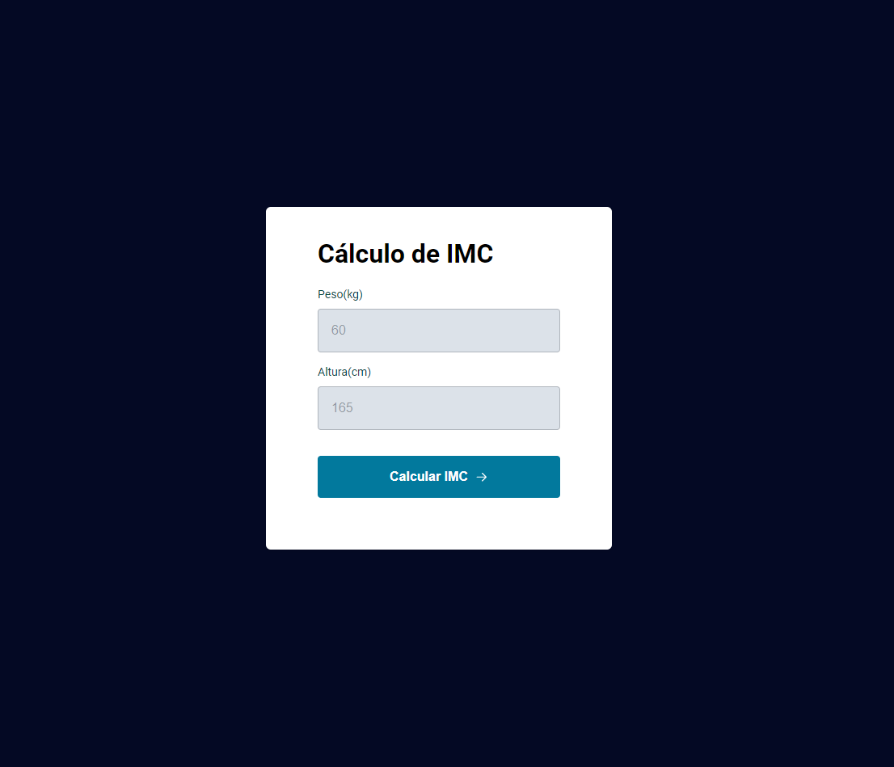
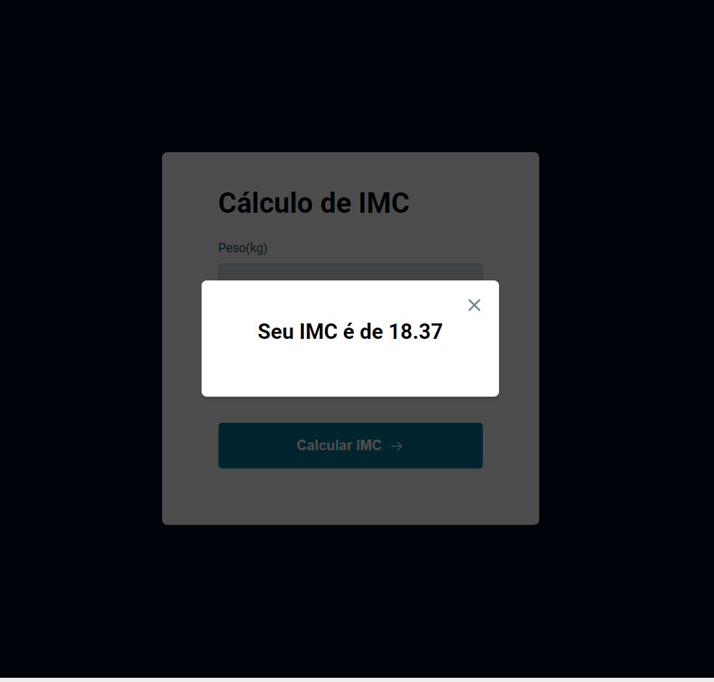
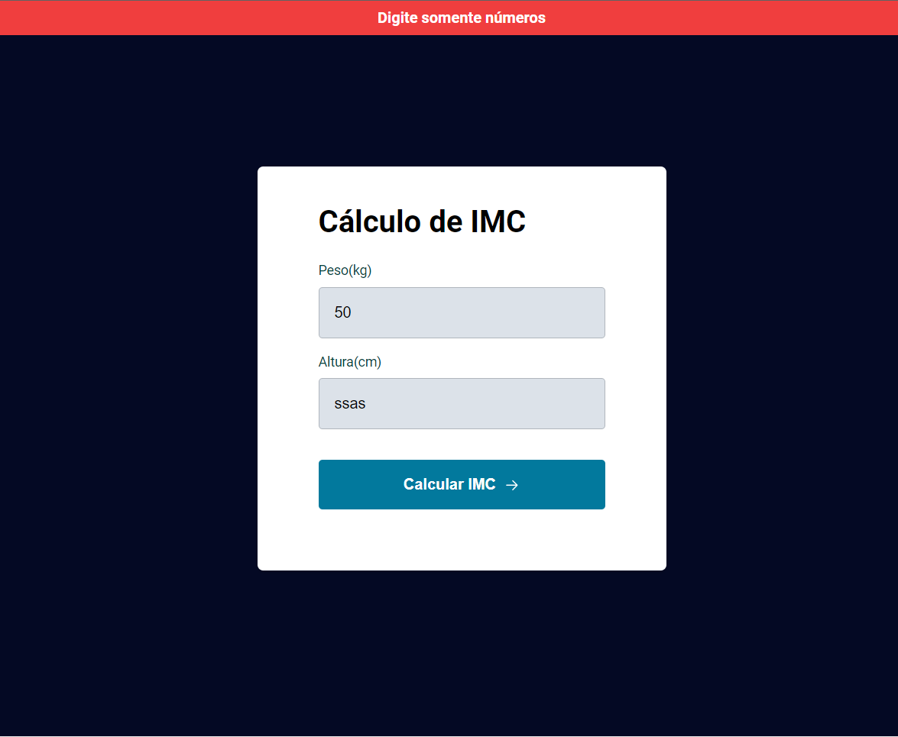

<h1 align="center">Explorer -  Stage05 - Calculo de Indice de Massa Corporal</h1>

&nbsp;&nbsp;&nbsp;

  

  🌎 Result Preview: [Veja o Projeto](https://explorer-indice-de-massa-corporal-stage05.vercel.app)

---

## 💻 Projeto - Calculo de IMC

Projeto realizado durante o programa Explorer da Rocketseat localizado no nível 5, onde construímos uma aplicação de cálculo de IMC para conhecer conceitos de ES6 Modules.

Imagem Calculo de IMC

## 🧪 Tecnologias | HTML ,CSS e JS.
---
- Funções
- Callbacks
- Eventos
- ES6 Modules  
  

##  📕 Sobre  

Este é um projeto desenvolvido em treinamento, juntamente com a 
<a  href="https://www.rocketseat.com.br">Rocketseat</a> 🚀
no decorrer do programa <b>Explorer</b>.

### Informações  

🕛 **Status:** Concluído✔️

☑️ **Task:** Construir um site estático a partir do projeto feito no [Figma](https://www.figma.com).
- [Design Figma - IMC](https://www.figma.com/file/iV07niIsYs4l0fuIMPk3wi/IMC-(Copy)?type=design&node-id=108-2&mode=design&t=ol6hvmCWW26ANQjN-0)
- [EXPLORER - Rocketseat](https://www.rocketseat.com.br/explorer)

Developed by Jeferson 🚀

